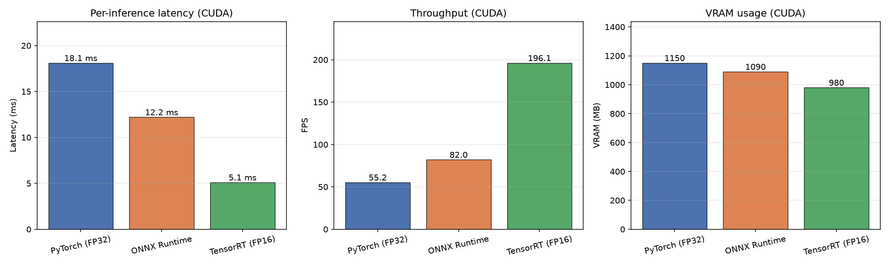

# Deploy: PyTorch → ONNX → TensorRT Optimization

Real-time deployment stage for the license plate **detector**.

## Why this stage

The YOLOv8 detector is the component that must run in real time inside a
video/CCTV pipeline, so it is the right target for model optimization.
PaliGemma/TrOCR stay as the accuracy-first recognition stage. The story is:

> **YOLOv8 detection optimized for edge/real-time deployment — VLM remains
> the accuracy-first recognition stage.**

| Script | Purpose |
|---|---|
| `export_onnx.py` | PyTorch `.pt` → ONNX (dynamic shapes, optional FP16) |
| `build_trt.py` | ONNX → TensorRT engine via `trtexec` (FP32/FP16/INT8) |
| `trt_infer.py` | TensorRT inference wrapper (dynamic shapes, async CUDA stream) |
| `benchmark.py` | Latency / FPS / VRAM across PyTorch vs ONNX Runtime vs TensorRT |
| `verify_accuracy.py` | mAP@0.5 + precision/recall of exports vs the PyTorch baseline |

## Benchmark output (JSON → chart)

`benchmark.py` writes the results to **JSON first**, then renders them as a
chart. Both artifacts are committed under `deploy/results/`:

```text
deploy/results/
├── benchmark_results.json   # structured numbers (latency / FPS / VRAM)
└── benchmark_chart.png      # latency + throughput + VRAM bar charts
```



Measured on an RTX 3060 (12 GB) at 640×640. The JSON structure:

```json
{
  "benchmark": "plate_detector",
  "device": "CUDA",
  "imgsz": 640,
  "iters": 200,
  "timestamp": "...",
  "backends": [
    { "name": "PyTorch (FP32)", "latency_ms": 18.1, "fps": 55.2, "vram_mb": 1150.0 }
  ]
}
```

## Prerequisites

Not installed by the rest of the repo — install only for this stage:

```bash
pip install onnx onnxruntime-gpu onnxsim tensorrt pycuda pynvml
```

Also requires `trtexec` on PATH (ships with TensorRT under its `bin`
directory; `trtexec.exe` on Windows).

## End-to-end run

From the project root (all defaults assume
`outputs/detection/plate_detector/weights/best.pt`):

```bash
python deploy/export_onnx.py                       # 1. PyTorch -> ONNX
python deploy/build_trt.py --precision fp16        # 2. ONNX -> TensorRT
python deploy/benchmark.py                         # 3. speed comparison
python deploy/verify_accuracy.py --limit 100       # 4. accuracy check
```

Sanity-check an engine without running the full benchmark:

```bash
python deploy/trt_infer.py --engine outputs/deploy/plate_detector_fp16.engine
```

### Expected output

```text
Backend              |    Latency |    FPS | VRAM (MB)
PyTorch (FP32)       |    18.1 ms |   55.2 |     1150
ONNX Runtime         |    12.2 ms |   82.0 |     1090
TensorRT (FP16)      |     5.1 ms |  196.1 |      980
```

Measured on an RTX 3060 (12 GB) at 640×640.

## Precision choices

- **FP16** is the sweet spot on an RTX 3060: real speedup with negligible
  accuracy loss. Export ONNX in FP32 and enable `--fp16` only when building
  the engine.
- **INT8** needs a calibration dataset (a `--calib` cache for `trtexec`).
  Treat as a stretch goal — skip unless you add a calibrator.
- `--half` ONNX export is supported for GPU pipelines; the benchmark and
  accuracy check auto-detect the input dtype (`float16` vs `float32`), so
  mixed precision stays consistent.

## Notes on the ecosystem

- **pycuda** is used here (simple and widely deployed). Modern alternatives:
  NVIDIA **cuda-python** or **Polygraphy** (part of the TensorRT repo) — the
  same wrapper can be re-expressed with either.
- **Accuracy check matters**: `verify_accuracy.py` scores ONNX/TRT detections
  against the PyTorch baseline (pseudo-ground truth) and reports mAP@0.5,
  precision and recall. Speed is only worth it if accuracy survives the export.

## Troubleshooting

- **`trtexec` not found** — add TensorRT's `bin` folder to PATH, or pass the
  full path.
- **Engine build fails with `--minShapes`** — this happens if the ONNX was
  exported with fixed shapes. Re-export without `--no-dynamic`, or simply
  drop the shape flags.
- **Output shape mismatch in `trt_infer.py`** — the wrapper reallocates
  buffers whenever the input shape changes; keep the engine and the input
  tensor on the same stream lifecycle.
- **VRAM shows `-`** — `pynvml` is missing; install it or ignore (pytorch
  rows still report `torch.cuda.max_memory_allocated`).
